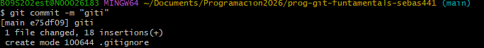

# Conceptos aprendidos
en esta sesion aprendimos a crear archivos,
documentos y usar la consola

git status sirve para saber el estados 
si ya se subio al stage o no 

el comando vim sirve para ver y editar que lo que ahi dentro de un archivo 

el commit sirve para subir el commit 
